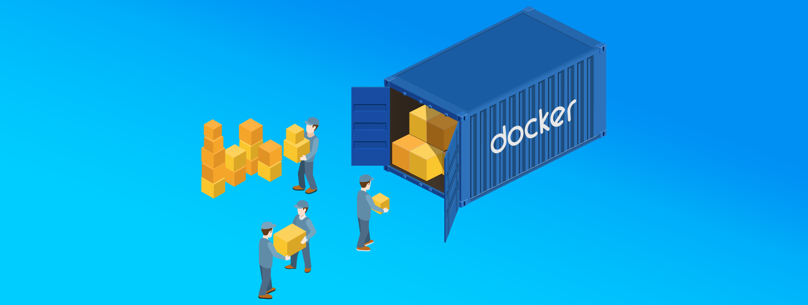

# Dockerfiles

<!-- Repo image -->

  <a href="https://github.com/redjax/Dockerfiles">
    <picture>
      <source media="(prefers-color-scheme: dark)" srcset=".assets/img/docker-header.png">
      
    </picture>
  </a>

<!-- Git Badges -->

  
  
  
  

---

Docker container images for different purposes. Some are runtime containers, others are meant to be run in CI/CD pipelines.

See the [usage docs](./docs/USAGE.md) for more information.

The [`nightly-update` pipeline](https://github.com/redjax/Dockerfiles/actions/workflows/nightly-update.yml) runs each night to check for new upstream tags and rebuild containers. Read more about this repository's pipelines in the [pipeline docs](./docs/PIPELINES.md).
