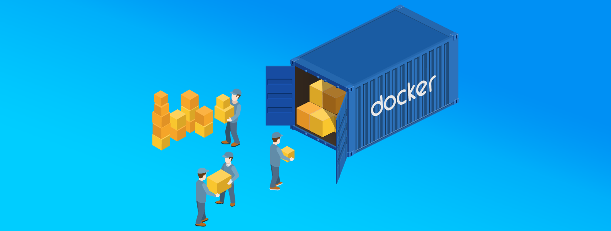

# Dockerfiles

<!-- Repo image -->
<p align="center">
  <a href="https://github.com/redjax/Dockerfiles">
    <picture>
      <source media="(prefers-color-scheme: dark)" srcset=".assets/img/docker-header.png">
      
    </picture>
  </a>
</p>

<!-- Git Badges -->
<p align="center">
  <a href="https://github.com/redjax/dockerfiles">
    
  </a>
  <a href="https://github.com/redjax/dockerfiles/commit">
    
  </a>
  <a href="https://github.com/redjax/dockerfiles/commit">
    
  </a>
  <a href="https://github.com/redjax/dockerfiles">
    
  </a>
</p>

---

A collection of my Dockerfiles organized by category. [Renovate](https://github.com/renovatebot/renovate) automations keep Docker image tags and CLI tooling versions fresh & updated.

When new tags & releases are available, Renovate opens PRs that bump version pins and, once auto-merged, triggers the build pipeline to rebuild & publish changed containers to the [package registry](https://github.com/redjax?tab=packages&repo_name=Dockerfiles).

See the [usage docs](./docs/USAGE.md) for more information.

## Quickstart

To pull and run an image from the [container registry](https://github.com/redjax?tab=packages&repo_name=Dockerfiles), run:

```shell
docker pull ghcr.io/redjax/dockerfiles/<container-name>:<tag>
```

For example, to pull the [`dockerfiles/taskfile` container](https://github.com/redjax/Dockerfiles/pkgs/container/dockerfiles%2Ftaskfile), run:

```shell
docker pull ghcr.io/redjax/dockerfiles/taskfile:<version, commit hash, or 'latest'>
```

Then you can run the container with:

```shell
docker run ghcr.io/redjax/dockerfiles/taskfile:<commitish> [commands]
```

These images can also be used as pipeline runner images.

## Automated Rebuilds

Each time Renovate runs, it reads each `Dockerfile`, Github Action/[workflow](./.github/workflows/), and any other pattern matched in the [`renovate.json` config](./renovate.json). When Renovate finds new versions, it opens a PR to the `main` branch.

This PR triggers the [`build-publish.yml` pipeline](./.github/workflows/build-publish.yml), which does a test build of any changed `Dockerfile`(s). If no `Dockerfile`s changed in the PR, the `renovate-gate` step succeeds and the PR will be merged automatically by Renovate.

If a `Dockerfile` did change via Renovate, the pipeline rebuilds the `Dockerfile` and publishes it to the Github Container Registry. Each time a container is published, it gets 2-3 tags:

- `latest`
- The commit hash, i.e. `7e5f400`
- A version tag, i.e. `3.23.4`
  - Some containers do not have a version tag and only use the commit hash

If a PR's `renovate-gate` stage fails, it means one of the previous steps (`plan` or `build`) failed, and Renovate will not merge the PR until the pipeline is succeeding again.
