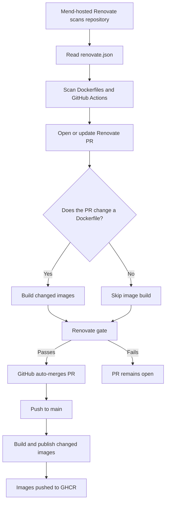

# Pipelines <!-- omit in toc -->

This repository uses GitHub Actions and the [Mend-hosted Renovate](https://developer.mend.io) service to keep Dockerfile dependencies and GitHub Actions versions current. Docker images are built and published automatically when relevant Dockerfiles change.

Pipeline logic lives in the [`scripts/`](../scripts/) directory wherever possible. Workflow files focus on orchestration, while build, publish, change-detection, and cleanup behavior remains reusable locally and in CI.

## Table of Contents <!-- omit in toc -->

- [Update and Release Workflows](#update-and-release-workflows)
- [Renovate](#renovate)
  - [Renovate Configuration](#renovate-configuration)
  - [Automated Update Flow](#automated-update-flow)
- [Build and Publish](#build-and-publish)
  - [Pull-request behavior](#pull-request-behavior)
  - [Push to main behavior](#push-to-main-behavior)
  - [Manual execution](#manual-execution)
- [Trim Images](#trim-images)
- [Authentication](#authentication)
  - [GitHub Authentication](#github-authentication)
  - [GitHub Actions Authentication](#github-actions-authentication)
  - [GHCR Authentication](#ghcr-authentication)
  - [Branch Protection and Automerge](#branch-protection-and-automerge)

## Update and Release Workflows

The repository uses these main components:

- [`renovate.json`](../renovate.json) configures the Mend-hosted Renovate service.
- [`.github/workflows/build-publish.yml`](../.github/workflows/build-publish.yml) validates changed Dockerfiles on pull requests and builds and publishes changed images after they merge to `main`.
- [`.github/workflows/trim-images.yml`](../.github/workflows/trim-images.yml) removes older GHCR image tags according to the configured retention policy.
- The [`scripts/`](../scripts/) directory contains reusable build, change-detection, publishing, and cleanup scripts.

> [!NOTE]
> Renovate runs as a cloud service. This repository does not use a repository-local Renovate GitHub Actions workflow.

## Renovate

Mend-hosted Renovate periodically scans the repository and opens pull requests for dependency updates. It may also trigger on PRs to `main`. Renovate uses the enabled managers configured in [`renovate.json`](../renovate.json):

- `dockerfile` detects Docker image references in Dockerfiles.
- `github-actions` detects GitHub Actions versions and pinned action digests.
- `custom.regex` reads `# renovate:` annotations associated with Dockerfile `ARG` values.

Dockerfile annotations associate version arguments with their upstream sources. For example:

```dockerfile
# renovate: datasource=docker depName=alpine versioning=semver
ARG ALPINE_TAG=3.24.1
```

or:

```dockerfile
# renovate: datasource=github-releases depName=Checkmarx/kics extractVersion=^v?(?<version>.*)$
ARG KICS_TAG=2.1.20
```

Renovate updates the annotated argument values directly in the Dockerfiles. Dependency updates to GitHub Actions are applied to workflow files, including digest pin updates configured by:

```json
"helpers:pinGitHubActionDigests"
```

### Renovate Configuration

The repository configuration is stored in [`renovate.json`](../renovate.json).

Renovate is configured to:

- Scan Dockerfiles, GitHub Actions, and annotated Dockerfile arguments.
- Open pull requests for available updates.
- Enable automerge for supported dependency updates.
- Use GitHub platform automerge.
- Wait for required branch-protection checks before merging.
- Rebase Renovate branches when necessary.

The repository must have GitHub auto-merge enabled. The `main` branch requires the stable `Renovate gate` status check described below.

Renovate PRs follow this process:

1. Renovate detects an available dependency update.
2. Renovate opens or updates a pull request against `main`.
3. GitHub Actions runs the repository validation workflow.
4. Dockerfile-changing PRs build the affected images.
5. The `Renovate gate` check reports the final validation result.
6. GitHub automatically merges the Renovate PR after the gate passes.
7. The merge produces a push to `main`.
8. The merged Dockerfile changes trigger the build-and-publish workflow.

Non-Dockerfile Renovate updates, such as GitHub Actions version or digest updates, **do not build** container images. They receive a successful lightweight gate and can be merged automatically.

### Automated Update Flow



## Build and Publish

The [`build-publish.yml`](../.github/workflows/build-publish.yml) workflow has two responsibilities:

- Validate Dockerfile changes on pull requests.
- Build and publish changed images after changes merge to `main`.

The workflow runs for every pull request targeting `main` so that the required `Renovate gate` check is always available. It does not build images for every pull request.

### Pull-request behavior

For pull requests:

1. The planning job determines which image directories are affected.
2. If no Dockerfile requires validation, the image-build job is skipped.
3. If one or more Dockerfiles changed, the affected images are built.
4. The final `Renovate gate` job waits for planning and any selected image builds.
5. The gate passes when:
   - Planning succeeds and no image build is needed, or
   - Planning succeeds and all selected image builds succeed.

The `Renovate gate` check is the only Docker-related status check that should be required by the `main` branch protection rule. The `Build selected images` job is intentionally conditional and must not be configured as a required check. This allows documentation, configuration, script, and GitHub Actions-only pull requests to merge without running container builds.

### Push to main behavior

For pushes/merges to `main`:

1. The workflow compares the new commit with the previous commit.
2. It determines which image directories changed.
3. It builds the affected images.
4. It logs in to GHCR using the repository's `GITHUB_TOKEN`.
5. It publishes the images marked with `publish: true` in their metadata.
6. Each image receives its configured registry tags, including `latest` and the short commit SHA.

The workflow publishes only on pushes to `main`. Pull-request and merge-group runs never publish images.

### Manual execution

The workflow can also be started with `workflow_dispatch` for an ad-hoc build.

Manual runs support:

- Selecting a specific image directory.
- Building all images with force mode.
- Enabling or disabling publication.
- Performing a dry run.
- Pulling fresh base images before building.

The build and publishing implementation is maintained in [`build-and-publish-images.sh](scripts/build/build-and-publish-images.sh). Changed-image detection is maintained in [`determine-images-to-build.sh`](scripts/build/determine-images-to-build.sh).

## Trim Images

The [`trim-images.yml`](../.github/workflows/trim-images.yml) workflow manages cleanup of older GHCR image tags.

It can run:

- After a successful build-and-publish workflow.
- Manually through `workflow_dispatch`.
- According to any additional schedule configured in the workflow.

The cleanup logic is implemented in [`trim-ghcr-images.sh`](scripts/cleanup/trim-ghcr-images.sh).

The script:

- Lists tags for configured GHCR images.
- Sorts tags according to the cleanup rules.
- Retains the configured number of recent tags.
- Deletes older tags when not running in dry-run mode.
- Supports a dry-run mode that reports deletions without changing the registry.

The default retention policy is documented in the workflow and cleanup script.

## Authentication

### GitHub Authentication

Mend-hosted Renovate requires access to this repository so it can inspect dependencies and manage update pull requests.

Renovate must be able to:

- Read repository contents.
- Read workflow files and Dockerfiles.
- Create and update Renovate branches.
- Open and update pull requests.
- Read pull-request checks.
- Enable or use GitHub automerge for Renovate pull requests.

Credentials used by the Mend-hosted Renovate service are configured through the Mend/Renovate integration, not through GitHub Actions environment variables.

> [!WARNING]
> Do not place Renovate credentials or personal access tokens in `renovate.json`.

### GitHub Actions Authentication

The build workflow requires:

```yaml
permissions:
  contents: read
```

The publishing job additionally requires:

```yaml
permissions:
  contents: read
  packages: write
```

Repository Actions settings must allow workflows to use the repository `GITHUB_TOKEN` with the required permissions.

### GHCR Authentication

The publishing job logs in to GHCR before pushing images:

```yaml
- name: Log in to GHCR
  uses: docker/login-action@v3
  with:
    registry: ghcr.io
    username: ${{ github.actor }}
    password: ${{ secrets.GITHUB_TOKEN }}
```

The package registry path is defined by each image's metadata. For example:

```yaml
registry_path: ghcr.io/redjax/dockerfiles/example
```

The repository's workflow token must have permission to publish to the corresponding GHCR package. If the package was created separately or is not automatically connected to the repository, configure repository access under the package's GHCR settings:

```text
Package settings
-> Manage Actions access
-> Add redjax/Dockerfiles
-> Grant write access
```

### Branch Protection and Automerge

The `main` branch should be configured with:

- Pull requests required before merging.
- The `Renovate gate` check required before merging.
- GitHub auto-merge enabled.
- No required `Build selected images` check, because that job is conditional.
- No required human approval that would block unattended Renovate merges, unless Renovate is explicitly permitted to satisfy that requirement.

The resulting automated flow is:

```text
Renovate update detected
→ Renovate PR opened
→ Dockerfile changes are validated when applicable
→ Renovate gate passes
→ GitHub auto-merges the PR
→ push to main triggers build and publish
→ updated images are pushed to GHCR
```

This keeps Docker builds limited to relevant Dockerfile changes while allowing Renovate to update and merge dependency pull requests without manual intervention.
