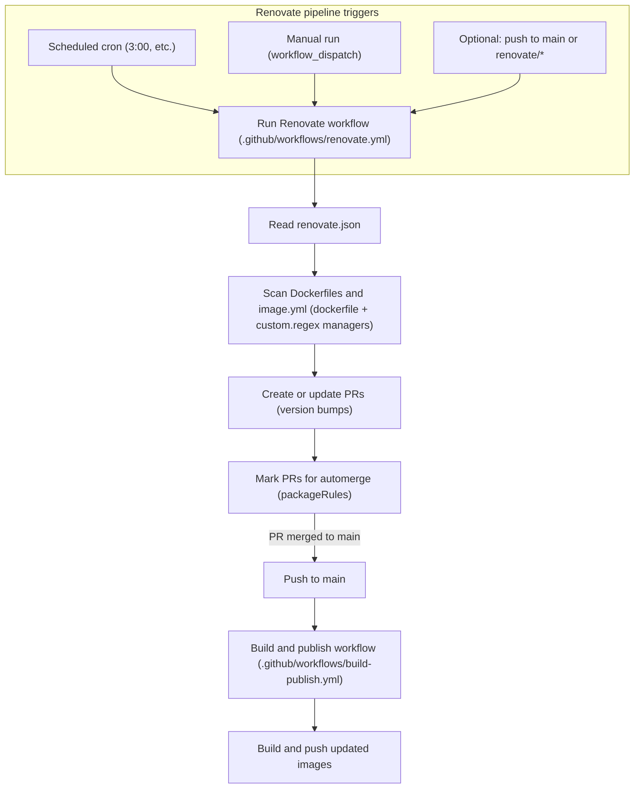

# Pipelines <!-- omit in toc -->

This repository uses GitHub Actions and [Renovate](https://github.com/renovatebot/renovate) to keep image manifests current and to build and publish container images when their manifests change.

The pipelines are split into small, reusable workflows so they can run on demand, chained together, or scheduled from a single entry point.

Pipeline logic lives in the [`scripts/`](../scripts/) directory wherever possible. This keeps the workflow files focused on orchestration and makes the build/publish and trimming logic easier to reuse locally or move to a different platform later.

## Table of Contents <!-- omit in toc -->

- [Update \& Release Workflows](#update--release-workflows)
  - [Renovate workflow](#renovate-workflow)
    - [Renovate Triggers](#renovate-triggers)
    - [Renovate Trigger Diagram](#renovate-trigger-diagram)
  - [Build and publish](#build-and-publish)
  - [Trim images](#trim-images)
- [Authentication](#authentication)
  - [Github Authentication](#github-authentication)

## Update & Release Workflows

The repository uses these main workflow entry points:

- [`renovate.yml`](../.github/workflows/renovate.yml) runs Renovate against this repository to discover new upstream container and tool versions and update `image.yml` manifests and Dockerfile version pins.
- [`build-publish.yml`](../.github/workflows/build-publish.yml) builds and publishes container images defined by `image.yml` when manifests or Dockerfiles change.
- [`trim-images.yml`](../.github/workflows/trim-images.yml) runs a script that checks the container registry and deletes a number of older images/tags (default: keep 5 most recent).

Each workflow can also be run manually, which makes it easier to test one stage without running the entire pipeline, or do emergency patches.

### Renovate workflow

The [Renovate workflow](../.github/workflows/renovate.yml) runs Renovate against this repository on a schedule (and on demand). Renovate:

- Reads `image.yml` manifests and Dockerfiles, including `components`, `upstream`, and `version_args`.
- Uses the `dockerfile` manager and custom `regexManagers` plus `# renovate:` comments in Dockerfiles to tie versioned `ARG` values to upstream sources (Docker images, GitHub releases, etc.).
- Detects new upstream versions (base images, tools, security scanners, etc.).
- Opens PRs that update:
  - `upstream.version` and `version_args` in `image.yml`.
  - Annotated `ARG` defaults in Dockerfiles.

With automerge enabled, Renovate merges those PRs automatically once checks pass. This replaces the previous bespoke tag bump scripts and pipelines. The pipeline runs 4x daily to pick up Renovate changes, and triggers any time a push to `renovate/*` branch occurs. This chains Renovate actions so automated merging works more reliably.

#### Renovate Triggers

The Renovate pipeline has the following triggers:

- Scheduled - Runs the pipeline 4x each day.
- `renovate/*` branch pushes: When a `renovate/*` pipeline changes, it triggers Renovate to perform actions like auto-merges and rebases.
- Manual - A `workflow_dispatch` triggers allows for running the pipeline manually with configurable options.

#### Renovate Trigger Diagram

Diagram showing the events that trigger the [`renovate.yml` pipeline](../.github/workflows/renovate.yml)

### Build and publish

The build and publish workflow reads the same `image.yml` manifests and builds the images marked for publication. Only images with `publish: true` are included in the publish step. Each image is tagged with its version from the manifest, `latest`, and a short commit SHA so the published image is easy to identify later.

The workflow is triggered:

- On pushes to `main` that modify `image.yml` or `Dockerfile` paths.
- Via `workflow_dispatch` for ad‑hoc builds.
- Via `workflow_call` when chained from other workflows.

When `dry_run` is enabled, the workflow prints the commands it would run instead of pushing images to GHCR. When `dry_run` is disabled, the workflow builds the image locally, applies the tags, and pushes them to the registry.

Renovate performs the version bumps, and this workflow reacts to those changes to rebuild and publish updated containers.

### Trim images

The trim images workflow orchestrates container registry cleanup. It runs after successful build/publish runs (via `workflow_run`), or on demand. It:

- Uses `scripts/cleanup/trim-ghcr-images.sh` to list existing tags for each image in GHCR.
- Deletes older tags beyond a configurable retention count (default: keep 5 most recent).
- Supports a dry‑run mode where it prints what it would delete without actually removing tags.

This keeps the registry tidy as Renovate continuously bumps versions and the build/publish workflow pushes new tags.

## Authentication

### Github Authentication

This repository uses a [Github Personal Access Token (PAT)](https://docs.github.com/en/authentication/keeping-your-account-and-data-secure/managing-your-personal-access-tokens) for Renovate and GitHub Actions. The permissions it needs are:

- Repository: Scoped to this repo
- Actions: `rw`
  - Allow actions to write data, i.e. image manifest updates and bumped Dockerfiles.
- Contents: `rw`
  - Make changes to files, allow `git commit` and `git push`.
- Metadata: `r`
- Pull requests: `rw`
  - Allow opening & managing automated PRs, including auto-merging when allowed.

The repository also requires GitHub Actions to have read/write access in the repository settings, so it can upload to and delete from the container registry.

Branch protection rules should be configured to allow Renovate to auto-merge its PRs (for example, by enabling "Allow auto-merge" and ensuring required checks are satisfied by the build/publish pipeline).
